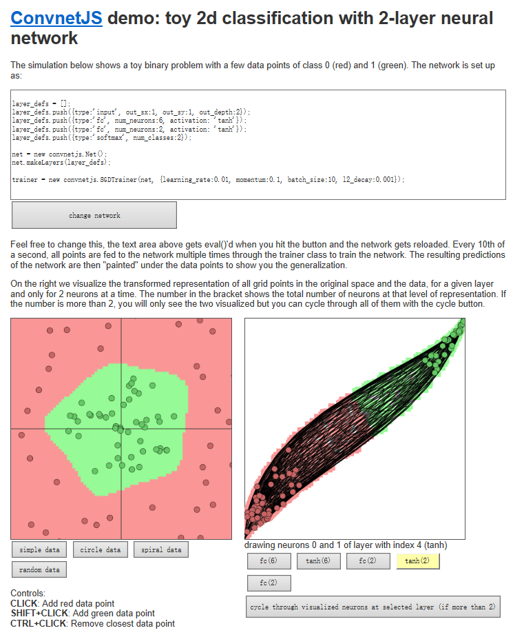
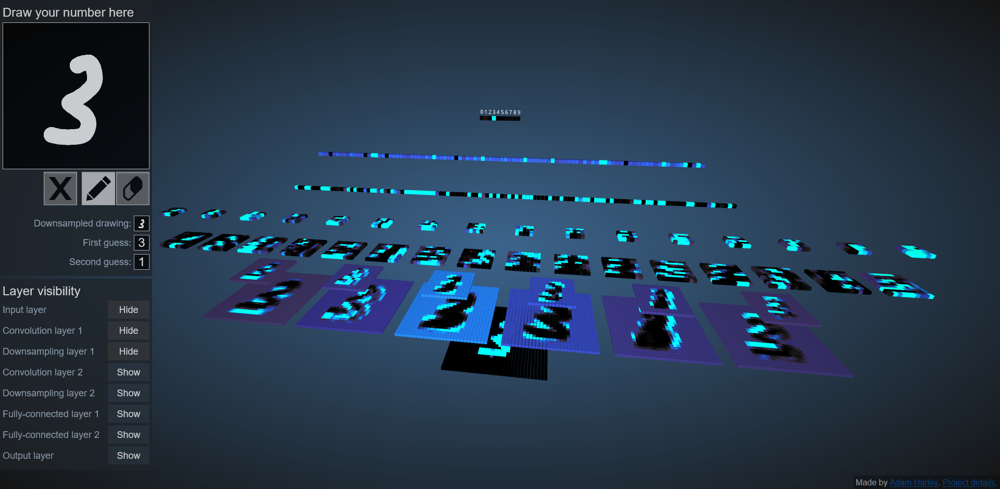
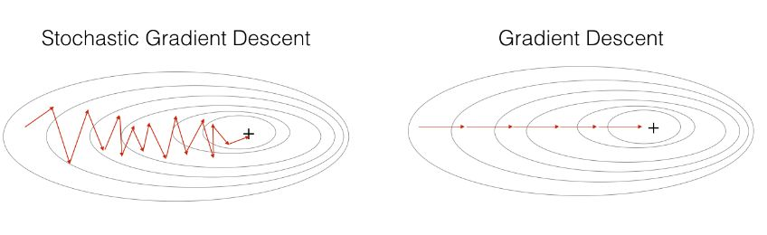
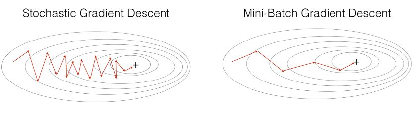
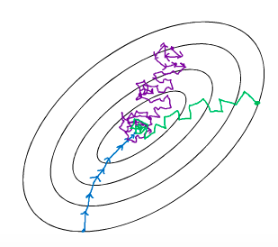
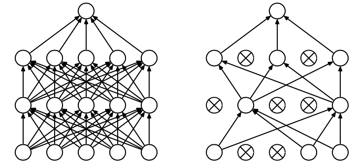
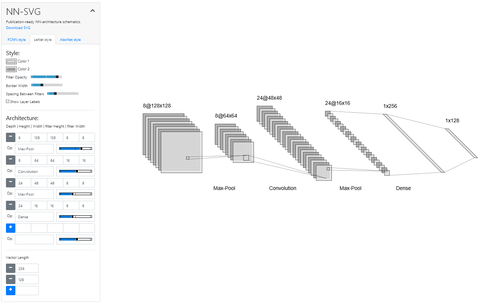

# Week1

## 神经网络原理

1. 基本变换：层

    数学理解：通过对输入空间的操作，完成 **输入空间 -> 输出空间** 的变换
    - $\vec y = a(W\cdot\vec x + b)$
    - 升降维、缩放、旋转：$W\cdot\vec x$
    - 平移：$+\vec b$
    - 弯曲：激活函数

2. 理解视角

    数学视角：线性可分

    当网络有很多层时，对原始空间的“扭曲”会大幅增加，让我们更容易找到一个超平面分割空间

    神经网络的学习就是学习如何利用 **矩阵的线性变换 + 激活函数的非线性变换** ，将原始空间投向线性可分/稀疏的空间去分类/回归。
     - **增加维度**：增加线性转换的能力
     - **增加层数**：增加激活函数的次数，增加非线性转换次数

    [Neural Networks, Manifolds, and Topology](http://colah.github.io/posts/2014-03-NN-Manifolds-Topology/)：

    > Theorem: Layers with N inputs and N outputs are homeomorphisms, if the weight matrix, W, is non-singular. (Though one needs to be careful about domain and range.)

    > The manifold hypothesis is that natural data forms lower-dimensional manifolds in its embedding space. There are both theoretical3 and experimental4 reasons to believe this to be true. If you believe this, then the task of a classification algorithm is fundamentally to separate a bunch of tangled manifolds.
    >
    > 流形假设是自然数据在其嵌入空间中形成低维流形。理论和实验都有理由相信这是真的。如果你相信这一点，那么分类算法的任务就是从根本上分离一堆纠结的流形。

    [可视化空间变化 demo](https://cs.stanford.edu/people/karpathy/convnetjs//demo/classify2d.html)：将神经网络每一层对空间的变化进行可视化，以全链接神经网络为例。

    

综上，神经网络可以理解为将输入空间不断变换，最终得到一个分类面。

增加全连接层可以提高数据线性可分的程度，但是跟数据的复杂情况有关。

以可视化空间变化 demo 为例，以 circle data  和 spiral data 为例，当激活函数为 relu 时，增加全连接层对 spiral 可以起到更好的分类效果，但是对 circle 则更大概率会过拟合。

## 卷积神经网络

[3D Visualization of a Covolutional Neural Network](http://scs.ryerson.ca/~aharley/vis/conv/)

## 梯度下降与随机失活

本周主要讲解各种梯度下降方法对训练的影响。

1. 背景知识、前期思路整理

    - 常用的若干神经网络结构
        
        本周实验使用 [MNIST](http://yann.lecun.com/exdb/mnist/) 数据集

        [TensorFlow代码实现（一）[MNIST手写数字识别]](https://blog.csdn.net/sysstc/article/details/74910918)

2. 梯度下降

    神经网络的求解可以看作一个多元函数最小值的求解问题。最普遍的方法就是梯度下降，以单层神经网络为例：$\vec y = a(W\cdot\vec x + b)$，我们要求出最小的 $W$ 使得输出的 $y'$ 与真实值 $y$ 的差尽可能小，即 $J(W) = ||y - y'||$ 最小。

    - 策略：
        - 随机赋 $W$ 初值
        - 改变 $W_i$ 的值，使 $J(W)$ 越来越小
        - 沿梯度相反方向下降

        > 梯度为一个向量，表示某一函数在某一点的方向导数沿该方向时取得最大值，即函数在该点处沿着该方向变化最快，变化率最大。

    - 举个例子：
 
        > 在爬山时，沿与等高线垂直的方向爬山，路最陡

    - 怎么操作：

        $$W_j^t = W_j^{t-1}-\alpha\frac{\partial}{\partial W_j}J(W)$$

        所有 $W_i$ 同时更新，其中 $\alpha$ 为学习率/更新步长，写成向量的形式就是：

        $$W^t = W^{t-1}-\alpha \nabla_W J(W)$$

    - 由此产生了一些衍生：
        - 批处理梯度下降
            - 每次更新都利用所有数据
            - 大样本下，迭代速度很慢
        - 随机梯度下降
            - 每次只用一个样本
            - 迭代速度快，大样本下较为有效，又被称为**在线学习**

    这些优化算法，本质上是一系列更新搜索方向的策略：
    - Batch gradient descent：采用整个训练集的数据来计算 cost function 对参数的梯度。
        $$\theta=\theta-\eta \cdot \nabla_{\theta} J(\theta)$$
        在一次更新中，根据整个数据集计算梯度，计算速度慢，遇到很大量的数据集也会非常棘手，而且不能投入新数据实时更新模型。是最传统的梯度下降策略。

        对于凸函数可以收敛到全局极小值，对于非凸函数可以收敛到局部极小值。

   - Stochastic gradient descent
        $$\theta=\theta-\eta \cdot \nabla_{\theta} J\left(\theta ; x^{(i)} ; y^{(i)}\right)$$
        每次更新时对每个样本进行梯度更新， 对于很大的数据集来说，可能会有相似的样本，这样 BGD 在计算梯度时会出现冗余，而 SGD 一次只进行一次更新，就没有冗余，而且比较快，并且可以新增样本，同时解决了 BGD 无法一次性将大量数据保存在内存的问题。

        因为每次训练的都是随机的一个样本，会导致导致梯度的方向不会像BGD那样朝着最优点，而且 SGD 因为更新比较频繁，会造成 cost function 有严重的震荡。

        

        BGD 可以收敛到局部极小值， SGD 的震荡可能会跳到更好的局部极小值处。
       
        > 代码中的随机把数据打乱很重要，因为这个随机性相当于引入了“噪音”，正是因为这个噪音，使得 SGD 可能会避免陷入局部最优解中。

        

        当我们稍微减小 learning rate，SGD 和 BGD 的收敛性是一样的。

    - Mini-batch gradient descent
        $$\theta=\theta-\eta \cdot \nabla_{\theta} J\left(\theta ; x^{(i : i+n)} ; y^{(i : i+n)}\right)$$
        每一次利用一小批样本，即 n 个样本进行计算， 这样它可以降低参数更新时的方差，相比 SGD 收敛更稳定。
 
        

        可以认为 BGD 与 SGD 实际上是 MBGD 的两个极端。比较常用的方法也就是这一种

    综上，我们可以这么看这三种梯度下降策略：

    

    同时，这三种方法也提供了一些需要解决的挑战：
    - 选择合适的学习率可能很困难。学习率太小会导致痛苦的缓慢收敛，而学习率太大会阻碍收敛并导致损失函数在最小值附近波动甚至发散。
    - 相同的学习率更新会被应用到所有的参数中，可能会产生一些问题。
    - SGD 在更新梯度时会困在鞍点，这些鞍点通常被相同误差的平台所包围，这使得SGD难以逃脱，因为梯度在所有维度上接近于零。

    因此，深度学习社区还提出了以下若干梯度下降优化算法：
    - Momentum
    - Nesterov accelerated gradient
    - Adagrad
    - Adadelta
    - RMSprop
    - Adam
    - ...

    感兴趣可以做进一步阅读：[为什么需要 Mini-batch 梯度下降，及 TensorFlow 应用举例](https://www.jianshu.com/p/d1f469d65470?utm_source=oschina-app)
    - [如何选择优化器 optimizer](https://blog.csdn.net/aliceyangxi1987/article/details/73210204)
    - [How to choose the right optimization algorithm?](https://stats.stackexchange.com/questions/55247/how-to-choose-the-right-optimization-algorithm)
    - [How to Select the Right Optimization Method for Your Problem ](http://www.redcedartech.com/pdfs/Select_Optimization_Method.pdf)
    - [An overview of gradient descent optimization algorithms](http://ruder.io/optimizing-gradient-descent/index.html#fn:24)
        - https://arxiv.org/pdf/1609.04747.pdf

3. 随机失活(Dropout)

    在机器学习的模型中，如果模型的参数太多，而训练样本又太少，训练出来的模型很容易产生过拟合的现象。过拟合具体表现在：模型在训练数据上损失函数较小，预测准确率较高；但是在测试数据上损失函数比较大，预测准确率较低。
   
    过拟合是很多机器学习的通病。如果模型过拟合，那么得到的模型几乎不能用。为了解决过拟合问题，一般会采用模型集成的方法，即训练多个模型进行组合。此时，训练模型费时就成为一个很大的问题，不仅训练多个模型费时，测试多个模型也是很费时。

    然后就产生了 dropout 

    dropout 是指在深度学习网络的训练过程中，对于神经网络单元，按照一定的概率将其暂时从网络中丢弃。注意是暂时，对于随机梯度下降来说，由于是随机丢弃，故而每一个mini-batch都在训练不同的网络。

    

    几个便于理解的例子：

    比如要搞一次恐怖袭击，两种方式： 
    > 集中50人，让这50个人密切精准分工，搞一次大爆破。 
    >
    > 将50人分成10组，每组5人，分头行事，去随便什么地方搞点动作，成功一次即可。

    显然是后者。因为将一个大团队作战变成了游击战。

    而 dropout 原论文中有一个这样的类比：

    > 在自然界中，在中大型动物中，一般是有性繁殖，有性繁殖是指后代的基因从父母两方各继承一半。但是从直观上看，似乎无性繁殖更加合理，因为无性繁殖可以保留大段大段的优秀基因。而有性繁殖则将基因随机拆了又拆，破坏了大段基因的联合适应性。
    > 
    > 但是自然选择中毕竟没有选择无性繁殖，而选择了有性繁殖，须知物竞天择，适者生存。我们先做一个假设，那就是基因的力量在于混合的能力而非单个基因的能力。不管是有性繁殖还是无性繁殖都得遵循这个假设。那么，有性繁殖的方式不仅仅可以将优秀的基因传下来，还可以降低基因之间的联合适应性，使得复杂的大段大段基因联合适应性变成比较小的一个一个小段基因的联合适应性。

    dropout 也能达到同样的效果，它强迫一个神经单元，和随机挑选出来的其他神经单元共同工作，达到好的效果。消除减弱了神经元节点间的联合适应性，增强了泛化能力。

    除了有性繁殖的类比，dropout 可解决过拟合还有如下的解释：

    - 取平均的作用：dropout 相当于在一个网络结构中训练了多个不同的子网结构，并依靠这些子网取均值去决定最终结果。这种“综合起来取平均”的策略**通常**可以有效防止过拟合问题，类似随机森林。因为不同的网络可能产生不同的过拟合，取平均则有可能让一些“相反的”拟合互相抵消，进一步达到整体上减少过拟合的效果。
    - 减少神经元之间复杂的共适应关系： 因为 dropout 导致两个神经元不一定每次都在一个 dropout 网络中出现。这样权值的更新不再依赖于有固定关系的隐含节点的共同作用，阻止了某些特征仅仅在其它特定特征下才有效果的情况。迫使网络去学习更加鲁棒的特征，这些特征在其它的神经元的随机子集中也存在。换句话说假如我们的神经网络是在做出某种预测，它不应该对一些特定的线索片段太过敏感，即使丢失特定的线索，它也应该可以从众多其它线索中学习一些共同的特征。
   
    具体来说 dropout 是这样操作的：

    1. 随机（临时）删掉网络中一半的隐藏神经元，输入输出神经元保持不变
    2. 然后把输入通过修改后的网络前向传播，并反向传播进一步优化参数。此时，没有被删除的神经元已得到对应的参数
    3. 恢复被删掉的神经元（此时被删除的神经元保持原样，而没有被删除的神经元已经有所更新）
    4. 从隐藏层神经元中随机选择一个一半大小的子集临时删除掉（备份被删除神经元的参数）
    5. 对一小批训练样本，先前向传播然后反向传播损失并根据随机梯度下降法更新参数（没有被删除的那一部分参数得到更新，删除的神经元参数保持被删除前的结果）

    在公式层面：
   
    无 dropout
   
    $$
    \begin{aligned} 
    z_{i}^{(l+1)} &=\mathbf{w}_{i}^{(l+1)} \mathbf{y}^{l}+b_{i}^{(l+1)} \\ 
    y_{i}^{(l+1)} &=f\left(z_{i}^{(l+1)}\right) 
    \end{aligned}
    $$

    有 droput

    $$
    \begin{aligned} 
    r_{j}^{(l)} & \sim \text { Bernoulli }(p) \\ 
    \widetilde{\mathbf{y}}^{(l)} &=\mathbf{r}^{(l)} * \mathbf{y}^{(l)} \\ 
    z_{i}^{(l+1)} &=\mathbf{w}_{i}^{(l+1)} \widetilde{\mathbf{y}}^{l}+b_{i}^{(l+1)} \\ 
    y_{i}^{(l+1)} &=f\left(z_{i}^{(l+1)}\right) 
    \end{aligned}
    $$

    上面公式中Bernoulli函数是为了生成概率r向量，也就是随机生成一个0、1的向量。
    
    代码层面实现让某个神经元以概率p停止工作，其实就是让它的激活函数值以概率p变为0

    感兴趣可以做进一步阅读：[深度学习中Dropout原理解析](https://zhuanlan.zhihu.com/p/38200980)

## 其他工具

[神经网络绘图工具](http://alexlenail.me/NN-SVG/LeNet.html)

